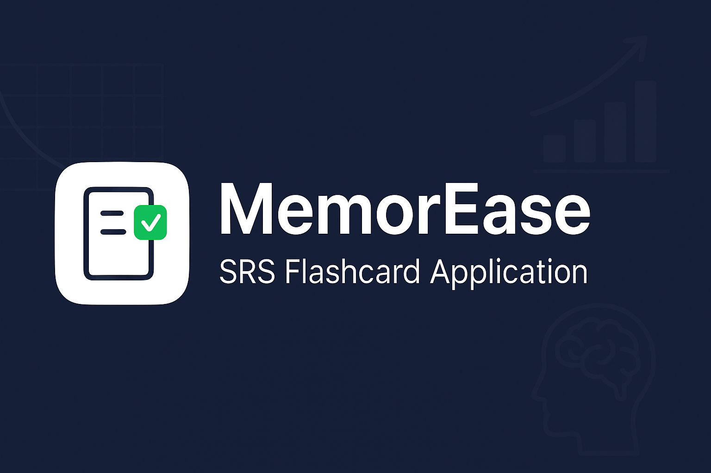

# MemorEase  

**MemorEase** is a desktop-based flashcard learning application built for multiple users, designed to run offline with a local database. It utilizes the **SM2 Spaced Repetition System (SRS) algorithm** to help users retain information effectively. MemorEase is developed using **Python**, **PyQt6**, and **SQLite**, with a clean and intuitive interface for managing, reviewing, and tracking flashcards.

---

## 📚 Features

- **User Authentication**
  - Login and register accounts locally.
- **Deck & Card Management**
  - Create, edit, and delete decks and cards.
  - Organize study materials by topic or subject.
- **SRS Review**
  - Implements the SM2 algorithm, adjusting ease factors, intervals, and repetitions.
  - Rewards "Easy" answers and penalizes "Hard" ones to optimize study intervals.
- **Import & Export**
  - Import and export decks in JSON format for easy sharing and backup.
- **Progress Tracking**
  - View statistics on review counts, accuracy, and deck completion.
- **Offline Capability**
  - Fully functional without an internet connection thanks to a local SQLite database.

---

## 🛠 Tech Stack

- **Programming Language:** Python  
- **GUI Framework:** PyQt6 + Qt Designer  
- **Database:** SQLite (local, lightweight, easy to manage)  
- **Algorithm:** SM2 Spaced Repetition System (SRS)  
- **Testing:** Pytest (unit testing) + manual UI testing  

---

## 📦 Installation

1. **Clone the repository**
   git clone https://github.com/daemon-10k/SRS_Flashcard.git
   cd SRS_Flashcard
2. **Install dependencies**
   pip install -r requirements.txt
3. **Run the application**
   python main.py

Usage:
- Create an account via the login/register screen.
- Create a new deck and add cards.
- Start reviewing cards using the SRS system.
- Track your progress via the statistics page.
- Import/Export decks in JSON format to share or backup your data.

Testing:

1. The app is tested with:
   - Pytest for backend and algorithm verification.
   - Manual UI testing for user flow and functionality.

2. Test cases include:
   - Empty deck scenario
   - Different review outcomes (Easy, Medium, Hard)
   - Database failure simulation
   - End-of-review session handling
   - All six core functional test cases passed successfully.

Target Users:
While primarily aimed at students, MemorEase is versatile enough for anyone who needs to memorize and retain information — from professionals preparing for certifications to hobbyists learning new skills.

Acknowledgements:
- SM2 Algorithm reference from SuperMemo. -> https://www.supermemo.com/en/archives1990-2015/english/ol/sm2
- PyQt6 documentation for GUI development.
- SQLite documentation for lightweight database integration.

